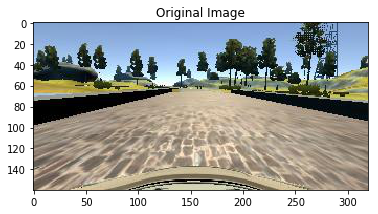
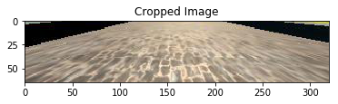
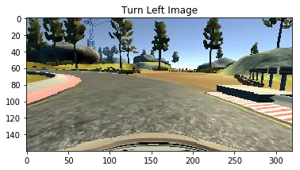
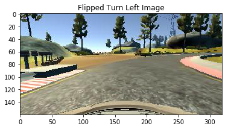
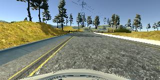
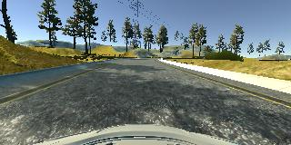

<h2>Behavioral Cloning</h2> 
---

**Behavioral Cloning Project**

The goals / steps of this project are the following:
* Use the simulator to collect data of good driving behavior
* Build, a convolution neural network in Keras that predicts steering angles from images
* Train and validate the model with a training and validation set
* Test that the model successfully drives around track one without leaving the road
* Summarize the results with a written report

[//]: # (Image References)

[image1]: ./examples/placeholder.png "Model Visualization"
[image2]: ./examples/placeholder.png "Grayscaling"
[image3]: ./examples/placeholder_small.png "Recovery Image"
[image4]: ./examples/placeholder_small.png "Recovery Image"
[image5]: ./examples/placeholder_small.png "Recovery Image"
[image6]: ./examples/placeholder_small.png "Normal Image"
[image7]: ./examples/placeholder_small.png "Flipped Image"

## Rubric Points
### Here I will consider the [rubric points](https://review.udacity.com/#!/rubrics/432/view) individually and describe how I addressed each point in my implementation.  

---

<h3>Model Architecture and Training Strategy</h3>

<h4>1. An appropriate model architecture has been employed</h4>
My model is based on Comma.AI's end-to-end self driving car convolution neural network: https://github.com/commaai/research/blob/master/train_steering_model.py 

I chose Comma.AI's model as it is a proven model that functions perfectly on a similar image input - in terms of size and features in the image.

For the final model architecture, see next section.

<h4>2. Attempts to reduce overfitting in the model</h4>

i) The model contains dropout layers after the two fully connected layers in order to reduce overfitting (model.py lines 129 & 132). 

ii) The model was trained and validated on different data sets to ensure that the model was not overfitting (code line 108 for training & validation set split). 

iii) The track is counter clockwise, so there are way more left turns than right turns. In order to combat the model from overfitting to left turn steering action, flip horizontal data augmentation technique was used and driving the track reverse to capture more right turn data was done (code line 66-68).

<h4>3. Model parameter tuning</h4>

The model used an adam optimizer, so the learning rate was not tuned manually (model.py line 141).

<h4>4. Appropriate training data</h4>

Training data was chosen to keep the vehicle driving on the road. Firstly I combine Udacity's dataset with my own training data in order to come up with the final data set.

For my own training data, I used mainly a combination of center lane driving, recovering from the left and right sides of the road, and reverse track driving. These training data compliments Udacity's dataset well. 

For details about how I created the training data, see the next section. 

<h2>#Model Architecture and Training Strategy</h2>

<h3>1. Solution Design Approach</h3>

<h5>Chosing model</h5>
My first step was to use a convolution neural network model similar to the Comma.AI's end-to-end self driving car convnet: https://github.com/commaai/research/blob/master/train_steering_model.py 

I chose Comma.AI's model as it is a proven model that functions perfectly on a similar image input - in terms of size and features in the image.

Note that Comma.AI's model already has dropout layers, so I just copy them and use the same keep probability hyperparameter

<h5>Preprocessing</h5>
1. I crop the top of the image by 70px and bottom 20px. The reason to do is that those top and bottom areas of the image won't help with the model to learn how to steer the car (i.e. sky & hood, trees), so by cropping them out the model can focus on what's important: Just the road. The advatange of doing this is that it makes the images smaller, thus we will get faster training.

2. Then I resize the image to 160x40. The reason to do this is to speed up the training.
3. Lastly I normalize the images, by now this is alredy second nature to me when I deal with convnet for images. This is done by adding a lambda layer that does the following operation: (x/255.0) - 0.5 (line 128)

<h5>First training attempt and evaluation</h5>
In order to gauge how well the model was working, I split my data set into training and validation set, with 80/20 split. I trained my model with Udacity's dataset, using Adam Optimizer (lr=0.0001) with batch size of 32 for 5 epochs. The end result was 0.2 loss on trainng set and 0.27 loss on validation set. I ran my model on the test track and it failed on the second turn. The model is underfitting, I need the training set loss to be lower (less than 0.05).

There are two ways to combat underfitting, one way is to have more useful data or to reduce the size of the model. The latter is not an option, as the model is of the right size for this problem, so I decided to focus on improving the data set. Also I decided to augment/improve udacity's dataset before adding my own dataset, as udacity's dataset is clean and probably is the best driving behavior I can find.

From inspection of Udacity's dataset, I find that quite a bit of the data are just going straight (steering angle of 0). The model needs to learn turning better, thus we need more data that contains non-zero steering angle.

I used a couple of strategy to add more non-zero steering angle data:

<h5>1. Adding left & right images data into the sample set</h5>
I augment the data by adding the left & right image data into the sample set. Now the question is what steering angle should I use for these images, to simulate a drive to center dataset? So I did a trial-and-error experiment below to find the best steering co-efficient:

| Steering angle co-efficient         		|     Observation of test track run	        					| 
|:---------------------:|:---------------------------------------------:| 
| 0.235         		| Steering turning a bit too sharp, too gittery even when driving straight  							| 
| 0.225     	| Model drives smoother on straight line, but fail to turn when corner too sharp 	|
| 0.230					|	Best result, quite smooth on straight line yet still able to turn at sharp corner											|

Result: Model is able to drive all left turn without problem, however when it encounters right turn it drives off the track. This means my model is not generalizing to turning right well-enough, so I need to augment/add more turning right data.

<h5>2. Adding traning data of center recovering from the left and right sides of the road</h5>
See section 3 below for more elaboration on this.

<h5>Flip horizontal & drive reverse track</h5>
1. Flip horizontal
In order to augment the data to get more right turns, I flip the image horizontal for every odd frame and reverse the steering co-efficient sign (line 64-67).

2. Drive reverse track
I collect more data of me drivign reverse track so that I get more right turn data point.

At the end of the process, the vehicle is able to drive autonomously around the track without leaving the road.

<h3>2. Final Model Architecture</h3>

The final model architecture (model.py lines 123-236) consisted of a convolution neural network with the following layers and layer sizes ...

| Layer         		|     Description	        					| 
|:---------------------:|:---------------------------------------------:| 
| Input         		| 160x40x3 RGB image   							| 
| Convolution 8x8     	| 4x4 stride, same padding, depth of 16 	|
| ELU					|												|
| Convolution 5x5     	| 2x2 stride, same padding, depth of 32 	|
| ELU					|												|
| Convolution 5x5     	| 2x2 stride, same padding, depth of 64 	|
| Flatten	      	|  				|
| Dropout		| Keep probability = 0.2       									|
| ELU					|				|
| Fully connected		| Output = 512        									|
| Dropout		| Keep probability = 0.5       									|
| ELU					|		
| Dropout	| Keep probability = 0.5        									|
| Fully connected		| Output = 1       									| Output = 43       									|
| Softmax				|  

<h3>3. Creation of the Training Set & Training Process</h3>

To capture good driving behavior, I first recorded two laps on track one using center lane driving. Here is an example image of center lane driving:

I then recorded the vehicle recovering from the left side and right sides of the road back to center so that the vehicle would learn to recover if it strays from center of the lane. These images show what a recovery looks like starting from right side :

I also do reverse track driving to get more right turn data.

To augment the data sat, I also flipped images and angles thinking so that the model will generalize better to both left and right turn. For example, here is an image that has then been flipped:

After the collection process, I had 11493 number of data points. I then preprocessed this data, please look at pre-process section above.

I finally randomly shuffled the data set and put 20% of the data into a validation set. 

I used this training data for training the model. The validation set helped determine if the model was over or under fitting. The ideal number of epochs was 7 as more than that the validation set lost oscilate which means it will only cause the model to overfit. I used an adam optimizer so that manually training the learning rate wasn't necessary.
